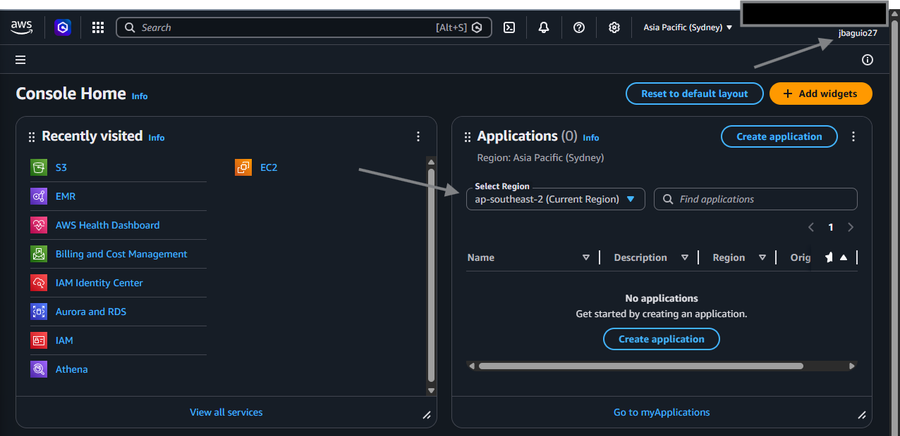
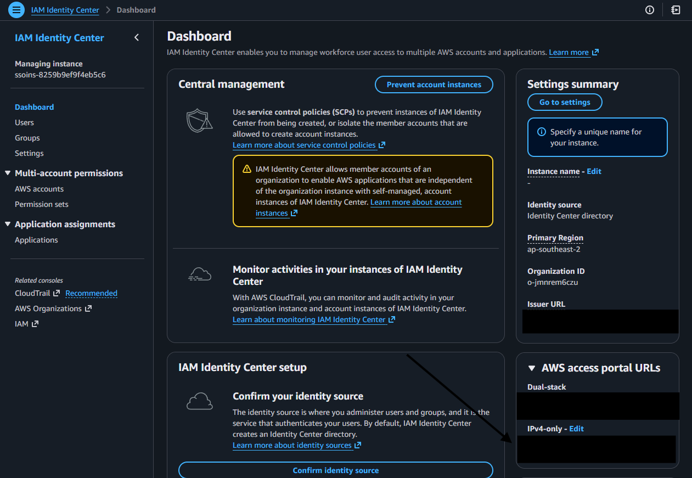
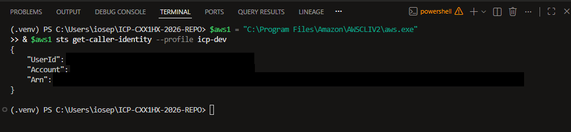
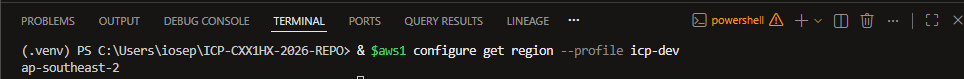

# Week 1 UI Runbook (Environment Setup)

Use this runbook to complete Week 1 setup tasks in AWS Console and capture evidence screenshots.

## Scope
- Confirm AWS account access.
- Configure and validate AWS SSO profile.
- Confirm project region and identity.

## Steps
1. Open AWS Console and sign in.
2. Open IAM Identity Center / AWS access portal.
3. Confirm your Start URL and region.
4. In terminal, run:
   - `aws sso login --profile <AWS_PROFILE>`
   - `aws sts get-caller-identity --profile <AWS_PROFILE>`
   - `aws configure get region --profile <AWS_PROFILE>`
5. Confirm region matches your intended project region.
6. Confirm identity account matches the AWS account you intend to use for this project.

## Evidence Checklist (Screenshots)
1. AWS Console signed-in page.

2. IAM Identity Center portal/start URL page.

3. Terminal output for `sts get-caller-identity`.

4. Terminal output for configured region.

