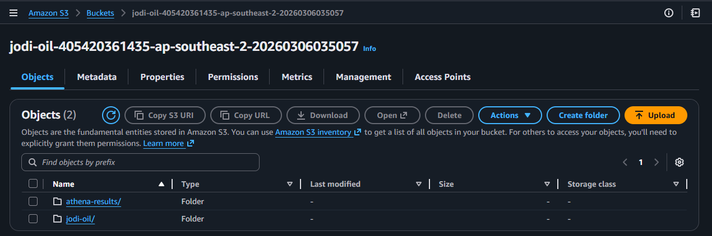
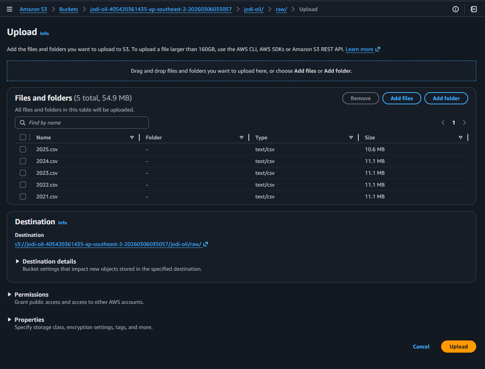
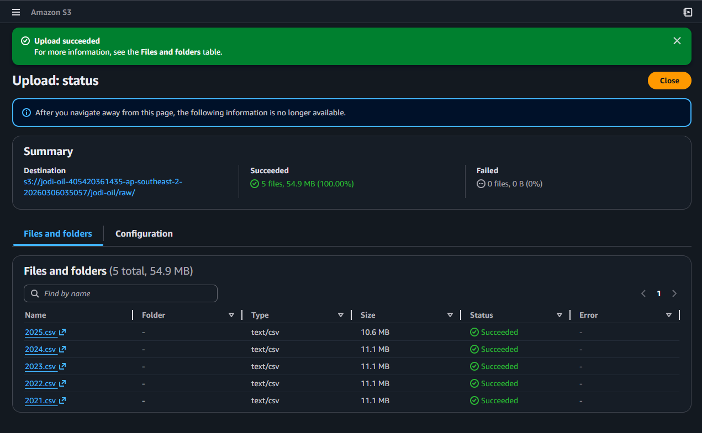
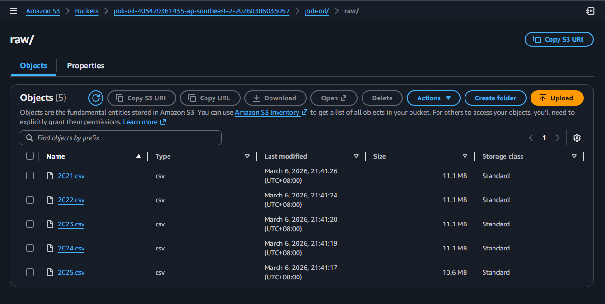

# Week 2 UI Runbook (S3 Raw Upload)

Use this runbook to upload raw CSV files in AWS Console and capture evidence screenshots.

## Scope
- Upload JODI-Oil CSV files (2021-2025) to S3 raw prefix.
- Verify files exist under raw path.

## Target Raw Prefix
- `s3://<your-bucket>/jodi-oil/raw/`

## Steps
1. Open AWS Console -> S3.
2. Open bucket `<your-bucket>`.
3. Open prefix `jodi-oil/raw/`.
4. Click `Upload` and select all CSV files.
5. Wait for upload completion.
6. Verify file list in `jodi-oil/raw/`.

## Evidence Checklist (Screenshots)
1. S3 bucket view before upload.

2. Upload dialog with selected CSV files.

3. Upload completion screen.

4. Final raw folder listing.

