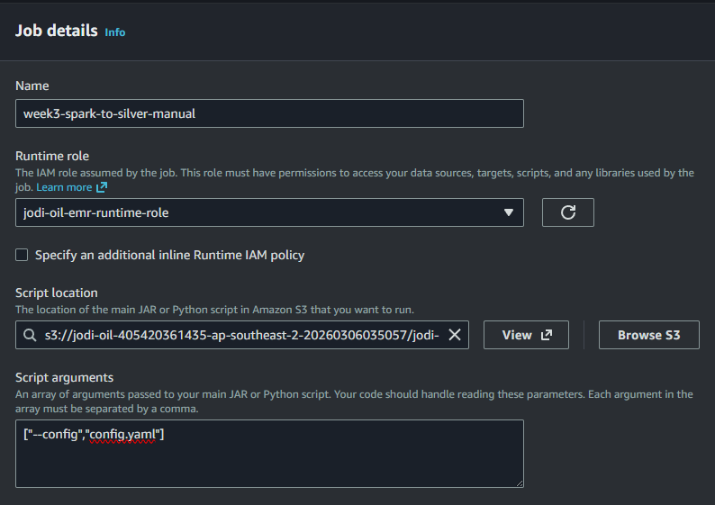
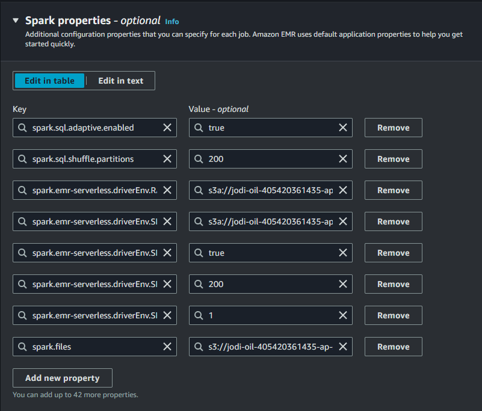
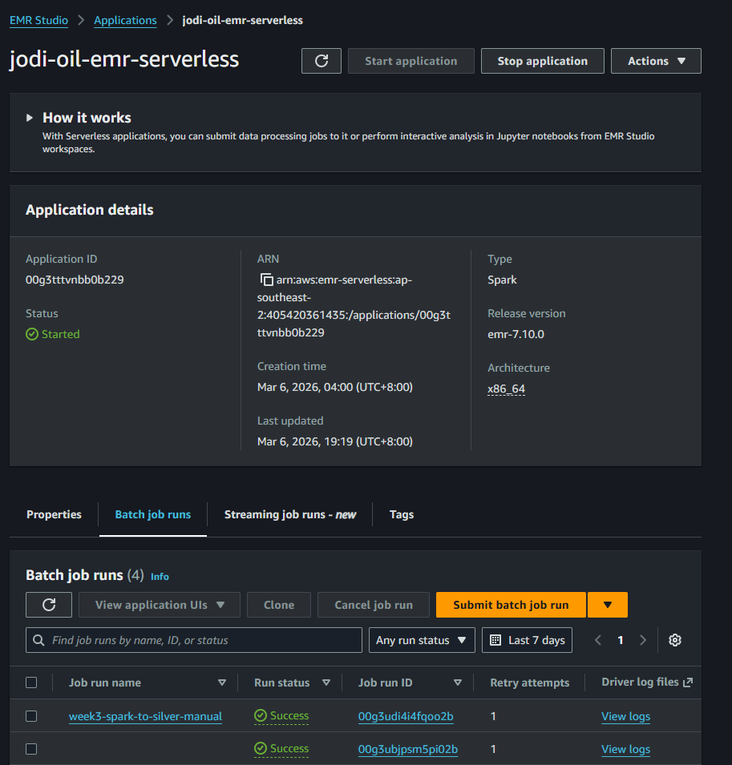
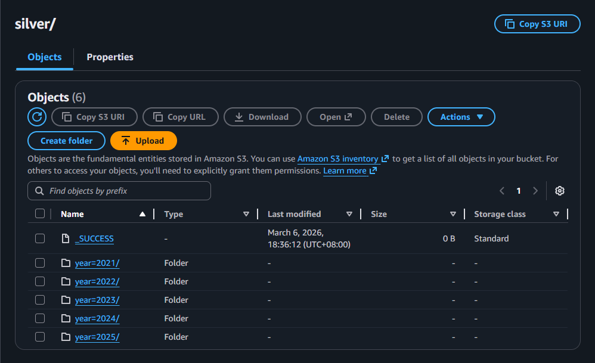

# EMR Serverless UI Runbook (Week 3 Silver)

Use this runbook to execute `spark_to_silver.py` manually in AWS Console and document evidence with screenshots.

## Target Job
- EMR Application ID: `<YOUR_EMR_APPLICATION_ID>`
- Runtime role: `<YOUR_EMR_RUNTIME_ROLE_NAME>`
- Script location:
  - `s3://<your-bucket>/jodi-oil/jobs/week3/spark_to_silver.py`
- Config file:
  - `s3://<your-bucket>/jodi-oil/jobs/week3/config.yaml`

## Step-by-Step (AWS Console UI)
1. Open AWS Console -> EMR -> EMR Serverless -> Applications.
2. Open your EMR Serverless Spark application.
3. If app is not running, click `Start application`.
4. Go to `Job runs` tab and click `Submit job`.
5. In Job details, set:
   - Name: `week3-spark-to-silver-manual`
   - Runtime role: `<YOUR_EMR_RUNTIME_ROLE_NAME>`
   - Script location: `s3://<your-bucket>/jodi-oil/jobs/week3/spark_to_silver.py`
   - Script arguments: `["--config","config.yaml"]`
6. In `Spark properties`, set:
   - `spark.sql.adaptive.enabled=true`
   - `spark.sql.shuffle.partitions=200`
   - `spark.files=s3://<your-bucket>/jodi-oil/jobs/week3/config.yaml`
   - `spark.emr-serverless.driverEnv.RAW_URI=s3a://<your-bucket>/jodi-oil/raw/`
   - `spark.emr-serverless.driverEnv.SILVER_URI=s3a://<your-bucket>/jodi-oil/silver/`
   - `spark.emr-serverless.driverEnv.SPARK_ADAPTIVE_ENABLED=true`
   - `spark.emr-serverless.driverEnv.SPARK_SHUFFLE_PARTITIONS=200`
   - `spark.emr-serverless.driverEnv.SPARK_TARGET_FILES_PER_PARTITION=1`
7. In `Additional configurations`, keep defaults except:
   - Runtime timeout: `60` minutes (recommended during development)
8. Submit job.
9. Open the run details and wait for terminal state.
10. Confirm job state is `SUCCESS`.
11. Verify Silver output in S3 under `jodi-oil/silver/`.

## Evidence Checklist (Screenshots)
Capture these screenshots:
1. Job submission form with key fields.

2. Spark properties section.

3. Job run details showing `SUCCESS`.

4. S3 Silver output listing (partitions/files).

