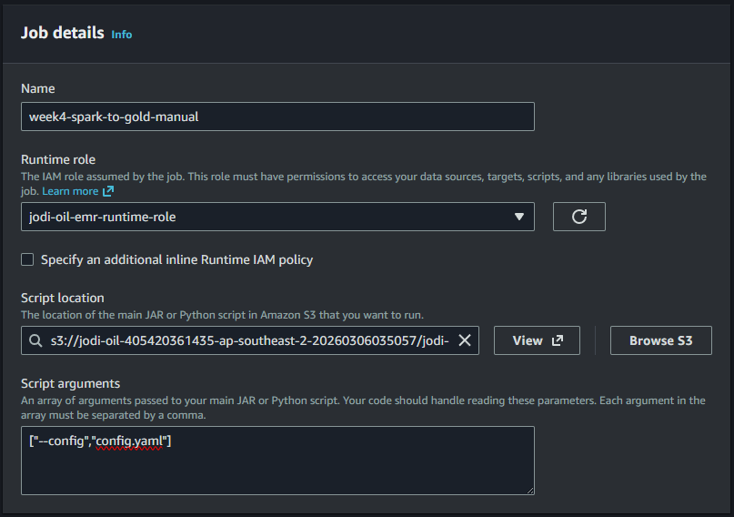
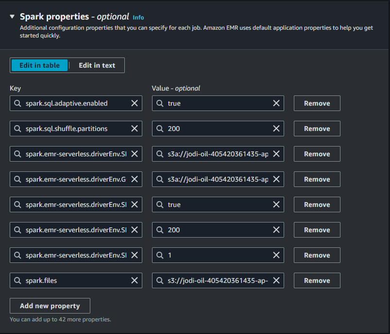
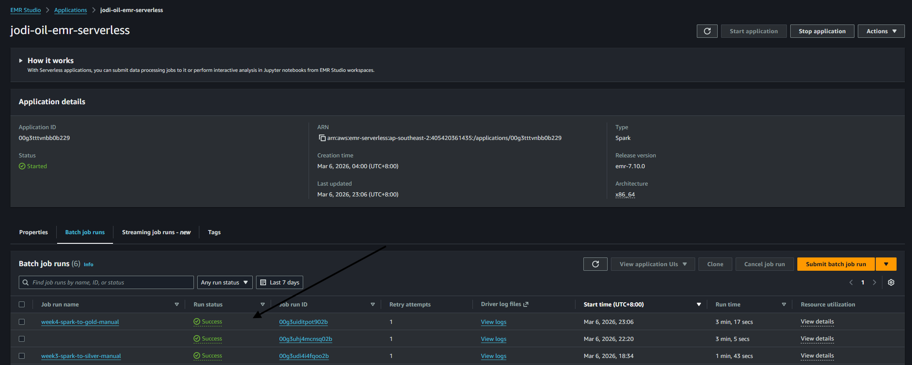
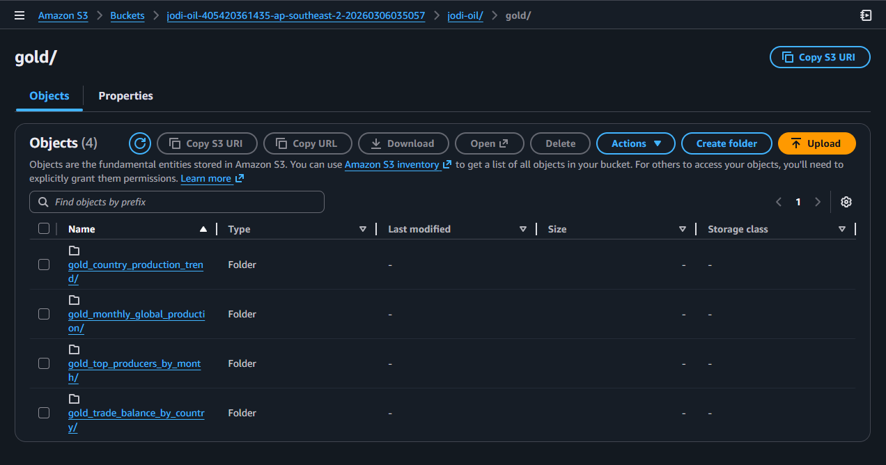
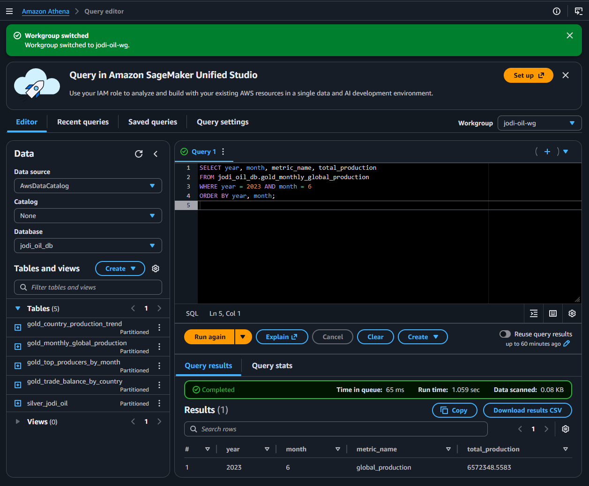
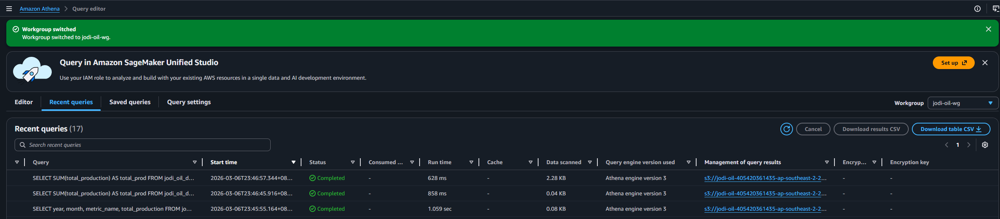

# Week 4 UI Runbook (Gold + Athena Validation)

Use this runbook to execute Week 4 from AWS Console and capture screenshots for evidence.

## Scope
- Run Gold Spark transformation in EMR Serverless.
- Verify Gold outputs in S3.
- Run Athena DDL and validation queries.
- Capture partition pruning proof.

## Target Job
- EMR application: `jodi-oil-emr-serverless`
- Runtime role: `jodi-oil-emr-runtime-role`
- Script:
  - `s3://<bucket>/jodi-oil/jobs/week4/spark_to_gold.py`
- Config:
  - `s3://<bucket>/jodi-oil/jobs/week4/config.yaml`

## Step-by-Step (AWS Console UI)
1. Open AWS Console -> EMR Serverless -> Applications.
2. Open app `jodi-oil-emr-serverless`.
3. If app is stopped, click `Start application`.
4. Go to `Job runs` -> `Submit job`.
5. In `Job details` (required), set:
   - Name: `week4-spark-to-gold-manual`
   - Runtime role: `jodi-oil-emr-runtime-role`
   - Script location: `s3://<bucket>/jodi-oil/jobs/week4/spark_to_gold.py`
   - Script arguments: `["--config","config.yaml"]`
6. In `Spark properties` (required), set:
   - `spark.sql.adaptive.enabled=true`
   - `spark.sql.shuffle.partitions=200`
   - `spark.emr-serverless.driverEnv.SILVER_URI=s3a://<bucket>/jodi-oil/silver/`
   - `spark.emr-serverless.driverEnv.GOLD_URI=s3a://<bucket>/jodi-oil/gold/`
   - `spark.emr-serverless.driverEnv.SPARK_ADAPTIVE_ENABLED=true`
   - `spark.emr-serverless.driverEnv.SPARK_SHUFFLE_PARTITIONS=200`
   - `spark.emr-serverless.driverEnv.SPARK_TARGET_FILES_PER_PARTITION=1`
7. In `Spark submit parameters` (required), add:
   - `--files s3://<bucket>/jodi-oil/jobs/week4/config.yaml`
8. In `Job configuration` (optional), keep defaults unless tuning:
   - During development, keep worker sizing defaults.
   - If timeout errors occur, increase runtime timeout.
9. In `Application logs and metrics` (optional but recommended):
   - Configure S3 logs: `s3://<bucket>/jodi-oil/logs/`
   - Keep CloudWatch logging enabled if available in your account view.
10. In `Additional configurations` (optional), recommended:
   - `Use AWS Glue Data Catalog as metastore`: leave unchecked for this job.
   - `Runtime timeout`: `60` minutes for dev runs.
   - `Maximum attempts`: `1` while debugging.
   - `Runtime version`: keep default (`Java 17` in your environment).
11. `Tags` section is optional.
12. Submit job and wait for terminal state.
13. Confirm job state is `SUCCESS`.
14. Verify Gold output in S3:
   - `jodi-oil/gold/gold_monthly_global_production/`
   - `jodi-oil/gold/gold_country_production_trend/`
   - `jodi-oil/gold/gold_top_producers_by_month/`
   - `jodi-oil/gold/gold_trade_balance_by_country/`
15. Open Athena (workgroup `jodi-oil-wg`, database `jodi_oil_db`).
16. Register metadata (DDL) from `Week4/docs/athena_ddl.sql` in this order:
   - `CREATE DATABASE IF NOT EXISTS jodi_oil_db;`
   - All `CREATE EXTERNAL TABLE IF NOT EXISTS ...` statements
   - All `MSCK REPAIR TABLE ...` statements
17. Verify metadata registration:
   - `SHOW TABLES IN jodi_oil_db;`
   - `SHOW PARTITIONS jodi_oil_db.gold_monthly_global_production;`
18. Run validation queries from:
   - `Week4/docs/athena_queries.sql`

## Athena DDL Troubleshooting
1. `TABLE_NOT_FOUND`
   - DDL was not executed or failed.
   - Re-run `CREATE EXTERNAL TABLE IF NOT EXISTS ...` and `MSCK REPAIR TABLE ...`.
2. Table exists but no rows
   - Check DDL `LOCATION` matches your real S3 Gold path.
   - Confirm `year=.../month=...` partitions exist in S3.
   - Re-run `MSCK REPAIR TABLE ...`.
3. Access denied
   - Confirm Athena, Glue, and S3 permissions for your active role/workgroup.

## Evidence Checklist (Screenshots)
1. Job details form before submit.

2. Spark properties section.

3. Job run details with `SUCCESS`.

4. S3 Gold output listing with partitions.

5. Athena validation query result.

6. Athena partition pruning proof (filtered vs unfiltered).

