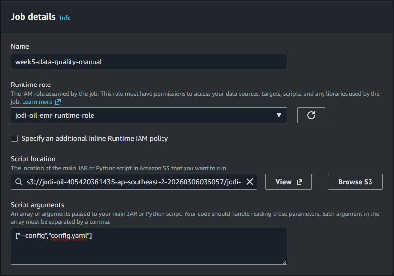
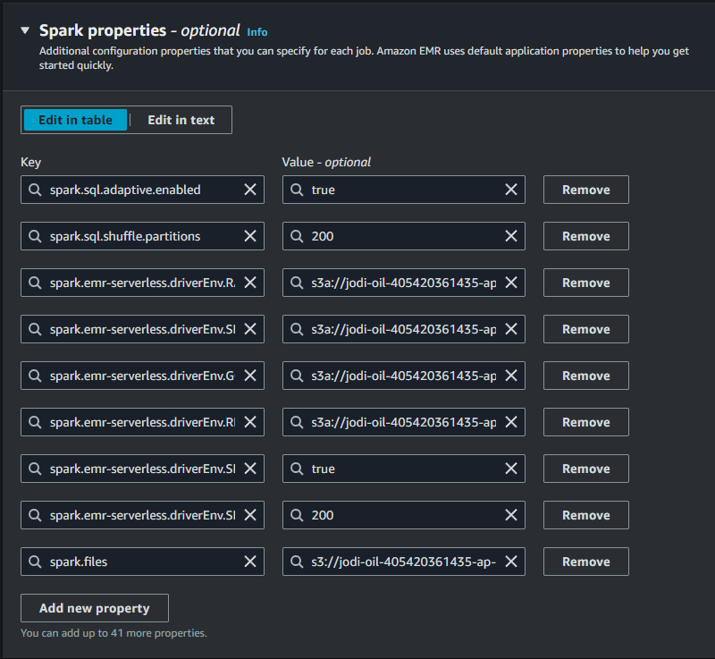
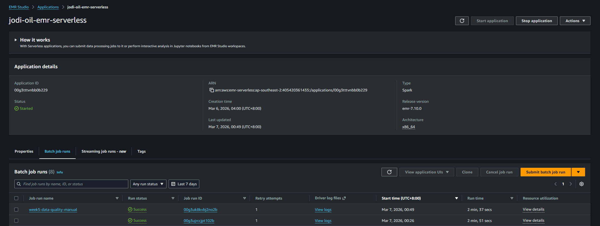
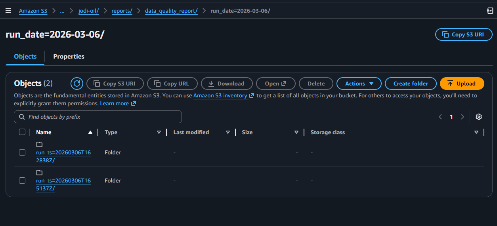
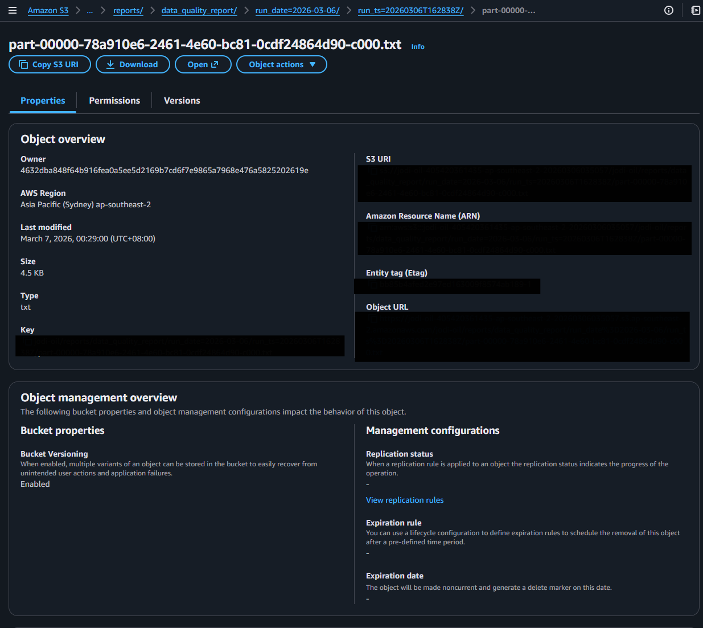

# Week 5 UI Runbook (Data Quality Job)

Use this runbook to execute Week 5 in AWS Console and capture screenshots.

## Target Job
- EMR application: `jodi-oil-emr-serverless`
- Runtime role: `jodi-oil-emr-runtime-role`
- Script:
  - `s3://<bucket>/jodi-oil/jobs/week5/data_quality_spark.py`
- Config file:
  - `s3://<bucket>/jodi-oil/jobs/week5/config.yaml`

## Step-by-Step (AWS Console UI)
1. Open AWS Console -> EMR Serverless -> Applications.
2. Open application `jodi-oil-emr-serverless`.
3. If needed, click `Start application`.
4. Go to `Job runs` -> `Submit job`.
5. In `Job details`, set:
   - Name: `week5-data-quality-manual`
   - Runtime role: `jodi-oil-emr-runtime-role`
   - Script location: `s3://<bucket>/jodi-oil/jobs/week5/data_quality_spark.py`
   - Script arguments: `["--config","config.yaml"]`
6. In `Spark properties`, set:
   - `spark.sql.adaptive.enabled=true`
   - `spark.sql.shuffle.partitions=200`
   - `spark.emr-serverless.driverEnv.RAW_URI=s3a://<bucket>/jodi-oil/raw/`
   - `spark.emr-serverless.driverEnv.SILVER_URI=s3a://<bucket>/jodi-oil/silver/`
   - `spark.emr-serverless.driverEnv.GOLD_URI=s3a://<bucket>/jodi-oil/gold/`
   - `spark.emr-serverless.driverEnv.REPORTS_URI=s3a://<bucket>/jodi-oil/reports/`
   - `spark.emr-serverless.driverEnv.SPARK_ADAPTIVE_ENABLED=true`
   - `spark.emr-serverless.driverEnv.SPARK_SHUFFLE_PARTITIONS=200`
7. In `Spark submit parameters`, add:
   - `--files s3://<bucket>/jodi-oil/jobs/week5/config.yaml`
8. In `Application logs and metrics`, set S3 logs:
   - `s3://<bucket>/jodi-oil/logs/`
9. In `Additional configurations` (recommended):
   - Runtime timeout: `60` minutes
   - Maximum attempts: `1`
10. Submit job and wait for terminal state.
11. Confirm status is `SUCCESS`.
12. Open S3 -> `jodi-oil/reports/data_quality_report/` and open latest run path.
13. Open report file (`part-*.txt`) and verify:
   - `summary.total_checks`
   - `summary.passed_checks`
   - `summary.failed_checks` is `0`

## Where to check pass/fail
1. EMR Job state:
   - `SUCCESS` means all quality checks passed.
   - `FAILED` means one or more checks failed (see `StateDetails` and logs).
2. S3 report exists:
   - Latest run folder exists under `data_quality_report/run_date=.../run_ts=.../`.
3. Report summary:
   - `failed_checks = 0` for a passing run.

## Evidence Checklist (Screenshots)
1. Job details form.

2. Spark properties and submit parameters.

3. Job run details showing `SUCCESS`.

4. S3 reports folder with latest run path.

5. Report file content showing summary and checks.

